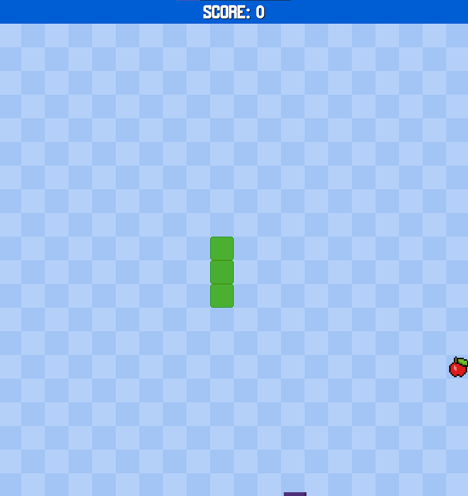
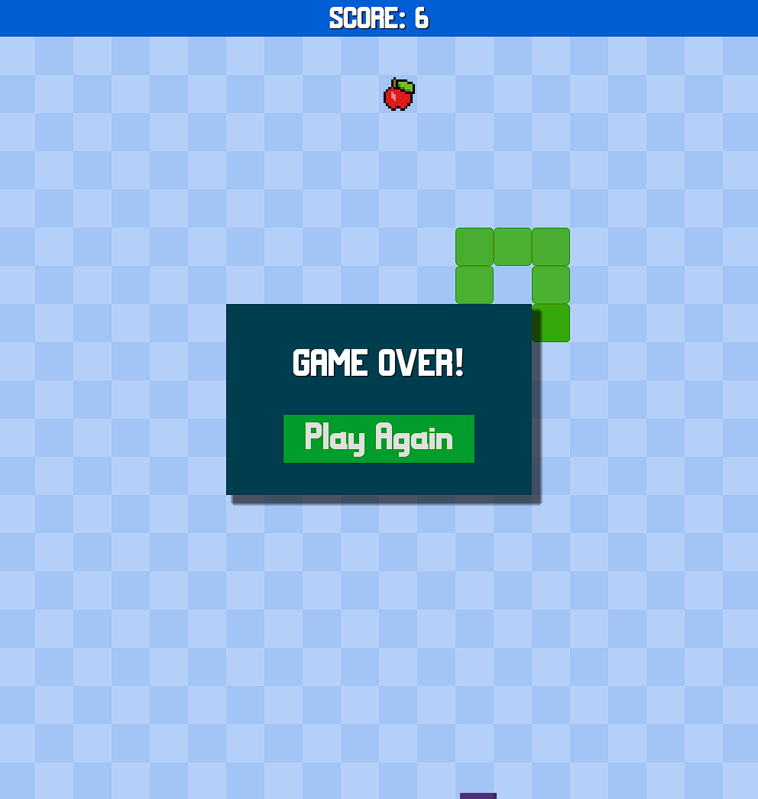

---
# :star: Snake 2D
This Snake Game Training project is a modern take on the classic Snake game, developed as a training exercise to practice and enhance game development skills using the Godot Engine. It's designed for anyone looking to explore basic game mechanics and improve their programming skills in a fun and interactive way.

# :camera: Screenshots

# :sparkles: Features
- Classic Snake Gameplay: Navigate the snake to eat food and grow longer.
- Smooth Controls: Responsive and intuitive controls for a seamless gameplay experience.
- Dynamic Food Placement: Food is randomly placed on the grid, ensuring a unique game each time.
- Score Tracking: Keep track of your score as you eat food and grow the snake.
- Game Over Detection: The game detects when the snake hits the wall or itself and displays a game over screen.
- Restart Functionality: Easily restart the game after a game over to try and beat your high score.

# :hammer_and_wrench: Stack used

**Front-end:** Godot Engine
    
# :books: Reference
[Coding With Russ](https://www.youtube.com/watch?v=DlRP-UBR-2A)

# :busts_in_silhouette: Authors
- [@imbiel-dev](https://www.github.com/imbiel-dev)